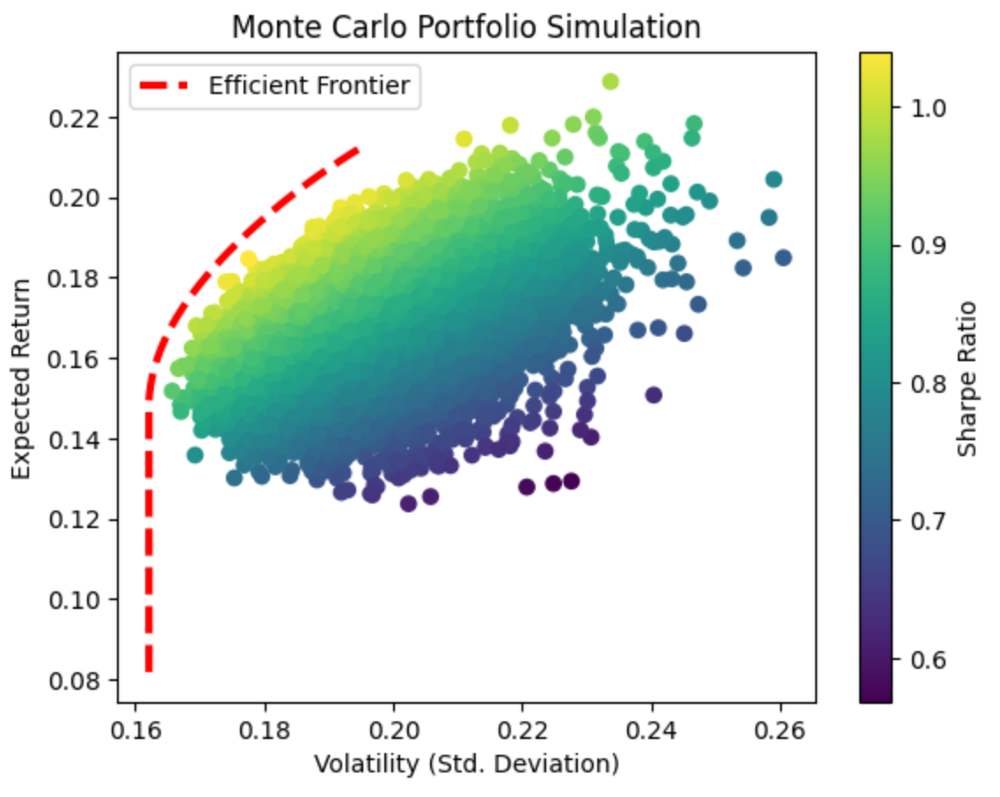
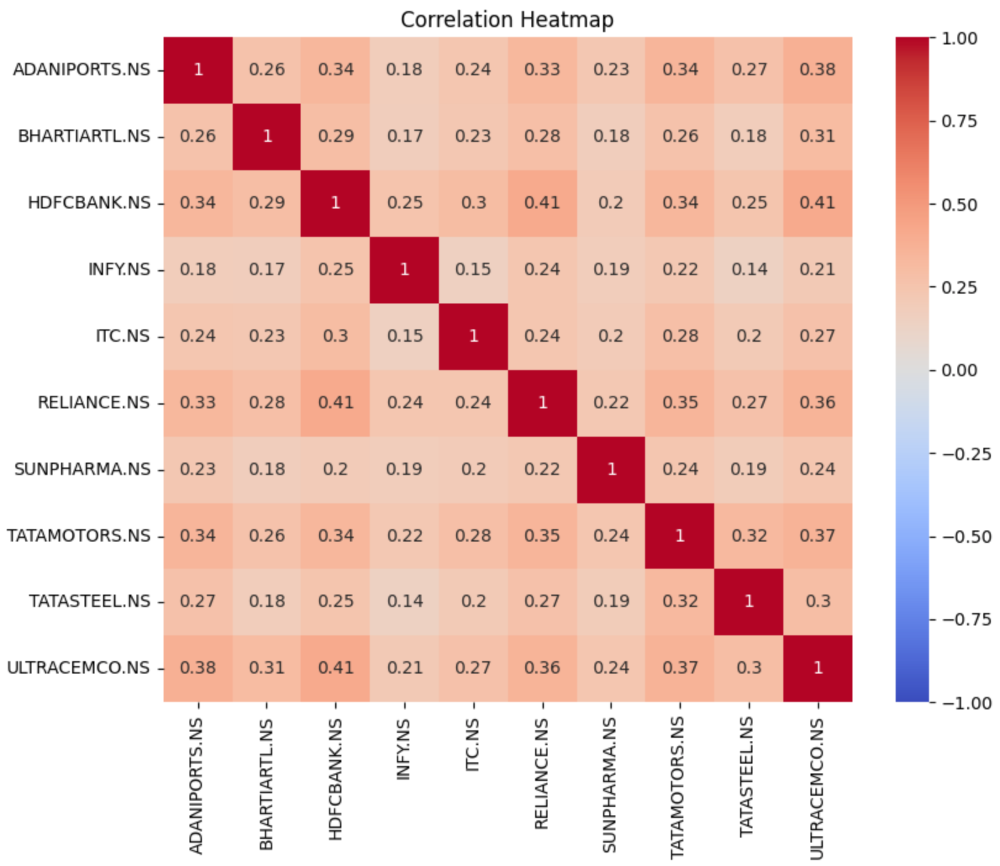
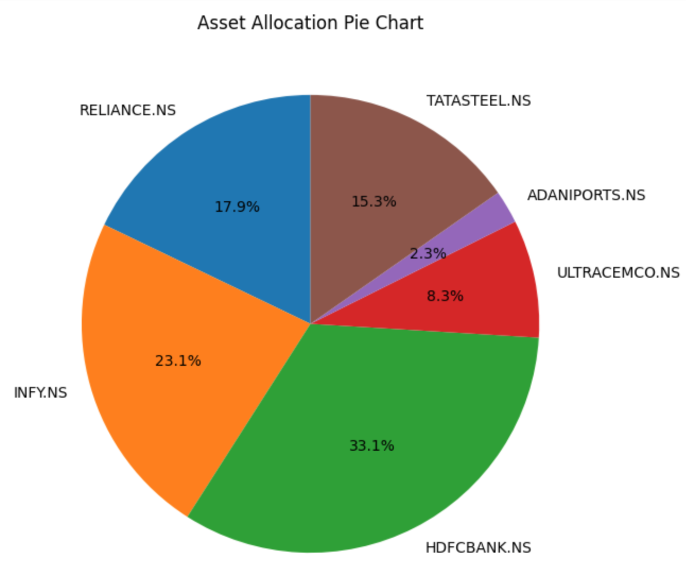

# IndianStockAnalysis
Portfolio optimization and analysis of top Indian stocks using Python. 

This project provides an analysis of 10 prominent stocks from India, aiming to derive insights on optimal portfolio allocation using methods such as the Sharpe Ratio and the Efficient Frontier. Utilised data from the past 10 years to conduct the analysis. 

## Project Overview 🧐

- **Stock Analysis**: Analyzed 10 major stocks from diverse sectors in the Indian market.
- **Portfolio Optimization**: Used the Sharpe Ratio and Efficient Frontier to determine the best weight allocation for the given assets to achieve optimal returns with minimal risk.
- **Monte Carlo Simulation**: Performed a Monte Carlo simulation of 10,000 portfolios to observe different combinations of asset weights.
- **Correlation Heatmap**: Plotted a heatmap to visualize how the selected stocks correlate with each other.
- **Asset Allocation Pie Chart**: Displayed the optimal portfolio allocation using a pie chart.

## Datasets 📊

The dataset used in this project contains daily stock prices for the following stocks from [Yahoo Finance](https://finance.yahoo.com/):
- [Infosys (INFY.NS)](https://in.finance.yahoo.com/quote/INFY.NS/)
- [HDFC Bank (HDFCBANK.NS)](https://in.finance.yahoo.com/quote/HDFCBANK.NS/)
- [Tata Motors (TATAMOTORS.NS)](https://in.finance.yahoo.com/quote/TATAMOTORS.NS/)
- [Reliance Industries (HCLTECH.NS)](https://in.finance.yahoo.com/quote/RELIANCE.NS/)
- [ITC Ltd (LT.NS)](https://in.finance.yahoo.com/quote/ITC.NS/)
- [Bharti Airtel (BHARTIARTL.NS)](https://in.finance.yahoo.com/quote/BHARTIARTL.NS/)
- [Tata Steel (TITAN.NS)](https://in.finance.yahoo.com/quote/TATASTEEL.NS/)
- [Sun Pharmaceutical (SUNPHARMA.NS)](https://in.finance.yahoo.com/quote/SUNPHARMA.NS/)
- [Adani Ports (HINDUNILVR.NS)](https://in.finance.yahoo.com/quote/ADANIPORTS.NS/)
- [UltraTech Cement (MARUTI.NS)](https://in.finance.yahoo.com/quote/ULTRACEMCO.NS/)

## Key Insights 🧠

1. **Efficient Frontier**: Visualized the portfolios that provide the maximum return for a given risk.
2. **Monte Carlo Simulation**: The simulation showcases a wide range of portfolio combinations, allowing for selection based on individual risk appetites.
3. **Correlation Analysis**: Reveals how the selected stocks move in relation to each other, providing insights into potential diversification benefits.
4. **Optimal Asset Allocation**: Highlights the optimal percentage allocation of each stock in the portfolio for maximum returns against minimal risk.

## Visualizations 📈

**Note**: Click on the image to view in full size.

## Potential Future Enhancements 🔍

- Incorporate additional financial metrics to aid in stock selection.
- Explore other portfolio optimization methods such as mean-variance optimization or the Black-Litterman model.
- Expand the analysis to include other asset classes like commodities, bonds, or REITs.

## Tools Used 🧰

- Python (Libraries: pandas, numpy, yfinance, matplotlib, seaborn)
- Jupyter Notebook

## Author

[sarthakb2403](https://github.com/sarthakb2403)

